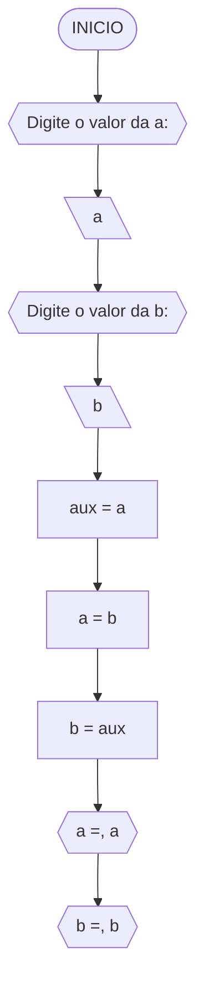
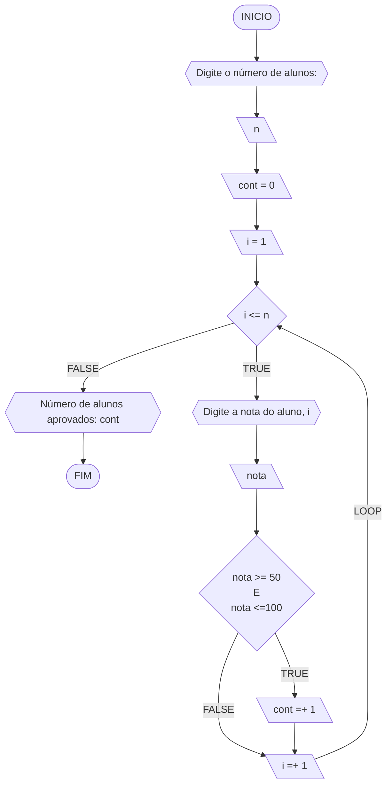
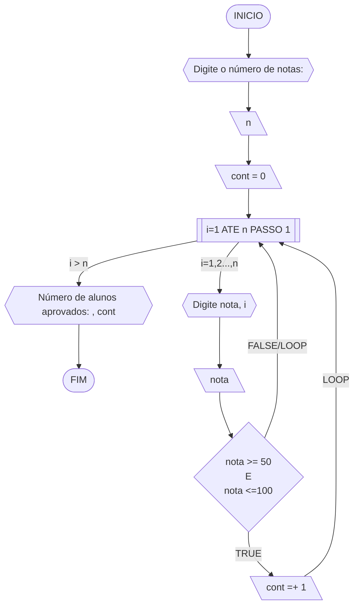
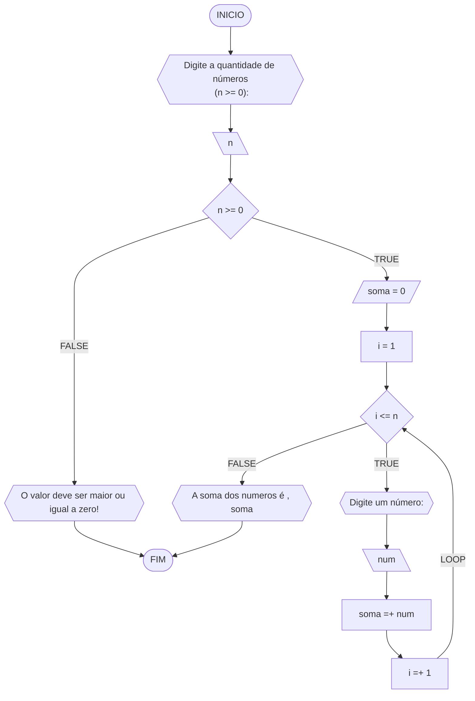
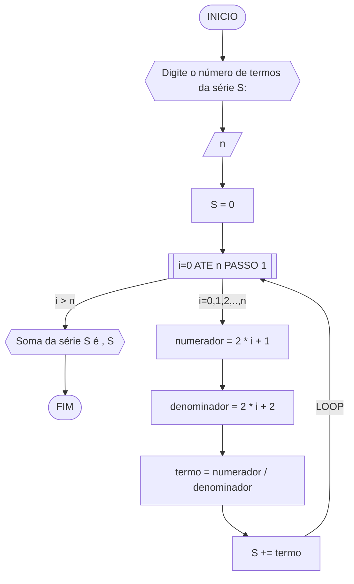
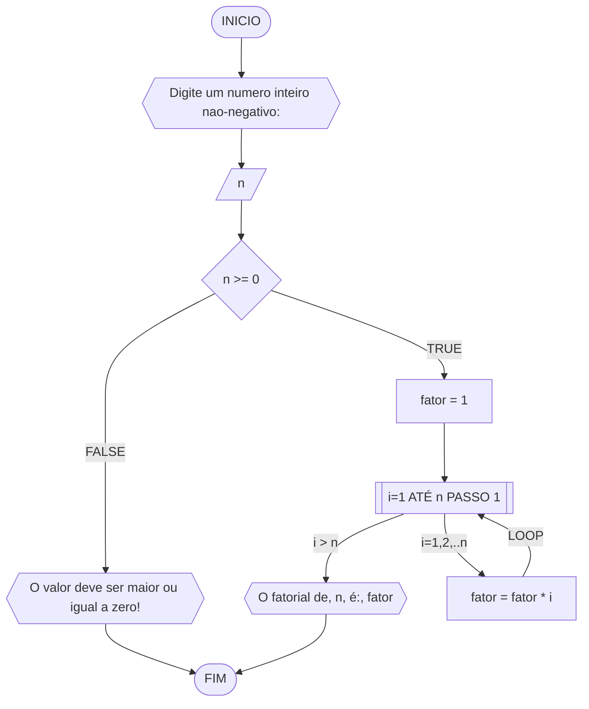
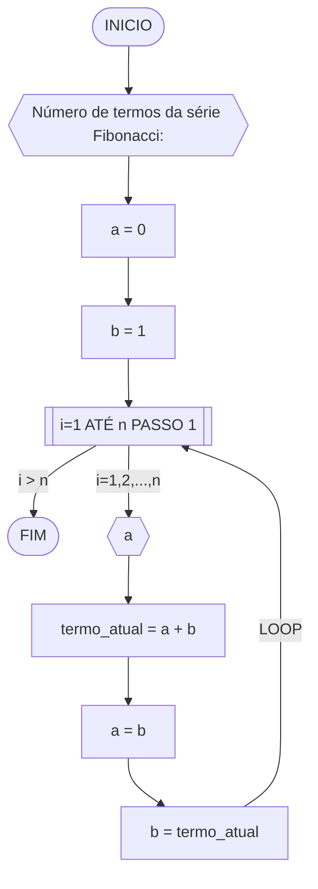

# unifor
**Curso:** Ciência da computação <br>
**Disciplina:** Raciocínio Lógico Algoritmo <br> 
**Código/Turma:** T160 - 60 <br>
**Professor:** Ricardo Carubbi <br>
**Data:** 20/03/2024 <br>
**Aluno(a):** Allan Justo de Freitas Guimarães <br>
**Matrícula:** 2413100 <br>

### Questão 1 - Troca dos valores de duas variáveis 
#### Fluxograma



#### Pseudocódigo
```
ALGORITIMO_TROCA DE VALORES
INÍCIO
// Solicitar ao usuário para digitar o valor de a
EXIBIR "Digite o valor da a:"
LER 
// Solicitar ao usuário para digitar o valor de b
EXIBIR "Digite o valor da b:"
LER b
// Trocar os valores de a e b usando uma variável auxiliar
aux = a
a = b
b = aux
// Exibir os novos valores de a e b
EXIBIR "a =", a
EXIBIR "b =", b
FIM_ALGORITIMO
```

#### Teste de mesa

| a  | b  | aux | a  | b  | saída 1 | saída 2 | 
| -- | -- | --  | -- | -- | --      | --      | 
| 0  | 1  | 0   | 1  | 0  | a = 1   | b = 0   |

### Questão 2 - Contagem 

Dado um conjunto $n$ de notas de alunos em um exame, implemente e teste um algoritmo para fazer uma contagem $cont$ do número de alunos que foram aprovados no exame. 
Será considerado aprovado o aluno que tirar $nota$ 50 ou maior (no intervalo de 0 a 100).

#### Fluxograma 01
Fluxograma conforme descrição do algoritmo acima, usando o loop ENQUANTO.



#### Fluxograma 02
Fluxograma opcional usando o loop PARA.



#### Pseudocódigo 
```
ALGORITIMO_CONTAGEM
// Fluxograma 01: usando loop ENQUANTO

// Passo 1: Solicitar ao usuário que digite o número de alunos
EXIBIR "Digite o número de alunos:"
LER n
// Inicializar o contador de alunos aprovados
cont = 0
// Inicializar o índice para o loop
i = 1
// Loop enquanto i for menor ou igual ao número de alunos (n)
ENQUANTO i <= n FAÇA
   
    // Passo 2: Solicitar ao usuário que digite a nota do aluno i
    EXIBIR "Digite a nota do aluno ", i, ":"
    LER nota
    ificar se a nota está no intervalo válido (entre 0 e 100) e é maior ou igual a 50
    SE nota >= 50 E nota <= 100 ENTAO
        // Se sim, incrementar o contador de alunos aprovados
        cont = cont + 1
    FIM SE
    // Incrementar o índice para o próximo aluno
    i = i + 1
FIM ENQUANTO
// Exibir o número de alunos aprovados
EXIBIR "Número de alunos aprovados:", cont
FIM_ALGORITIMO
```
#### Teste de mesa 01
Teste de mesa referente ao algoritmo usando o loop ENQUANTO.

| it | n  | i  | cont | i<=n  | nota, i | nota | nota_valida | cont+1 | i+1 | saída        | 
| -- | -- | -- | --   | --    | --      | --   | --          | --     | --  | --           |
| 1  | 3  | 1  |  0   | True  | nota 1  | 60   | True        | 1      | 2   |              |
| 2  | 3  | 2  |  1   | True  | nota 2  | 40   | False       | 1      | 3   |              |
| 3  | 3  | 3  |  1   | True  | nota 3  | 90   | True        | 2      | 4   |              |
| 4  | 3  | 4  |  2   | False |         |      |             |        |     | Aprovados: 2 |

#### Teste de mesa 02
Teste de mesa referente ao algoritmo usando o loop PARA.

| it | n  | cont | i  | nota, i | nota | nota_valida | cont+1 | saída        | 
| -- | -- | --   | -- | --      | --   | --          | --     | --           |
| 1  | 3  | 0    | 1  | nota 1  | 60   | True        | 1      |              |
| 2  | 3  | 1    | 2  | nota 2  | 40   | False       | 1      |              |
| 3  | 3  | 1    | 3  | nota 3  | 90   | True        | 2      | Aprovados: 2 |

### Questão 3 - Soma de um conjunto de números 
Dado um conjunto de $n$ números, implemente e teste um algoritmo para calcular a soma desses números. <br>
Aceite apenas $n$ maior ou igual a zero



#### Pseudocódigo
```
Algoritmo SOMA_NÚMEROS 
INÍCIO
// Solicitar ao usuário que digite a quantidade de números (n >= 0)
EXIBIR "Digite a quantidade de números (n >= 0):"
LER n
// Verificar se n é maior ou igual a zero
SE n < 0 ENTAO
    // Se não for, exibir mensagem de erro e encerrar o programa
    EXIBIR "O valor deve ser maior ou igual a zero!"
SENÃO
    // Inicializar a variável soma com zero
    soma = 0
    // Inicializar o índice para o loop
    i = 1
    // Loop para ler os números e somá-los
    ENQUANTO i <= n FAÇA
        // Solicitar ao usuário que digite um número
        EXIBIR "Digite o número ", i, ":"
        LER num
        // Adicionar o número à soma
        soma = soma + nu
        // Incrementar o índice
        i = i + 1
    FIM ENQUANTO

    // Exibir a soma dos números
    EXIBIR "A soma dos números é ", soma
FIM SE
FIM
```
#### Teste de mesa

| it | n  | n >= 0 | soma | i  | i <= n | num | soma =+ num  | saída                   |
| -- | -- | --     | --   | -- | --     | --  | --           | --                      |
|    | -3 | False  |      |    |        |     |              | O valor deve ser ...    |
| 1  | 0  | True   | 0    | 1  | False  |     |              | A soma dos números é 0  |
| 1  | 3  | True   | 0    | 1  | True   | 5   | 0 + 5 = 5    |                         |
| 2  | 3  | True   | 5    | 2  | True   | 10  | 5 + 10 = 15  |                         |
| 3  | 3  | True   | 15   | 3  | True   | 20  | 15 + 20 = 35 |                         |
| 4  | 3  | True   | 35   | 4  | False  |     |              | A soma dos números é 35 |

### Questão 4 - Cálculo de uma série 
Dado um conjunto de $n$ termos da série, implemente e teste um algoritmo para calcular o valor de S, conforme definido abaixo:

$$ S = \frac{1}{2} + \frac{3}{4} + \frac{5}{6} + \frac{7}{8} + \dots $$

#### Pseudocódigo
```
Algoritmo SomaSerie
INÍCIO
// Solicitar ao usuário que digite o número de termos da série S
EXIBIR "Digite o número de termos da série S:"
LER N
// Inicializar a variável S para armazenar a soma dos termos da série
S = 0
// Loop para calcular a soma dos termos da série
PARA i DE 0 ATÉ n PASSO 1 FAÇA
    // Calcular o numerador para o termo atual
    numerador = 2 * i + 1
    // Calcular o denominador para o termo atual
    denominador = 2 * i + 2
    // Calcular o termo atual da série
    termo = numerador / denominado
    // Adicionar o termo à soma da série S
    S += termo
FIM PARA
// Exibir a soma da série S
EXIBIR "Soma da série S é ", S
FIM_ALGORITIMO

#### Teste de mesa (0.25 ponto)
```
| it | n  | S  | i | numerador | denominador | termo | S += termo     | saída                  |
| -- | -- | -- |-- | --        | --          | --    | --             | --                     |
|    | 0  | 0  |   |           |             |       |                |                        |
| 1  | 4  | 0  | 0 | 2*0+1 = 1 | 2*0+2 = 2   | 1/2   | 0+1/2 = 1/2    |                        |
| 2  | 4  | 0  | 1 | 2*1+1 = 1 | 2*1+2 = 2   | 3/4   | 1/2+3/4 = 1.25 |                        |
| 3  | 4  | 0  | 2 | 2*2+1 = 1 | 2*2+2 = 2   | 5/6   | 0+1/2 = 2.08   |                        |
| 4  | 4  | 0  | 3 | 2*3+1 = 1 | 2*3+2 = 2   | 7/8   | 0+1/2 = 2.96   | Soma da série S é 2.96 |
```
### Questão 5 - Cálculo fatorial 
Dado um número $n$, implemente e teste um algoritmo para calcular o fatorial de $n$ (escrito como $n!$), onde $n ≥ 0$.
```
#### Fluxograma



#### Pseudocódigo
```
Algoritmo_CalcFatorial
INÍCIO

// Solicitar ao usuário que digite um número inteiro não-negativo
EXIBIR "Digite um número inteiro não-negativo:"
LER n

// Verificar se n é maior ou igual a zero
SE n < 0 ENTAO
    // Se não for, exibir mensagem de erro e encerrar o programa
    EXIBIR "O valor deve ser maior ou igual a zero!"
SENÃO

    // Inicializar o fatorial como 1
    fatorial = 1
    // Calcular o fatorial de n
    PARA i DE 1 ATÉ n PASSO 1 FAÇA
        // Multiplicar o fatorial pelo valor de i
        fatorial = fatorial * i
    FIM PARA

    // Exibir o fatorial de n
    EXIBIR "O fatorial de ", n, " é: ", fatorial
FIM SE
FIM_ALGORITIMO
```
```
#### Teste de mesa
| n  | fator | i  | fator = fator * i | saída               |
| -- | --    | -- | --                | --                  |
| 3  | 1     | 1  | 1*1 = 1           |                     |
| 3  | 1     | 2  | 1*2 = 2           |                     |
| 3  | 2     | 3  | 2*3 = 6           | O fatorial de 3 é 6 |
```
### Questão 6 - Geração da sequência de Fibonacci 
Gerar e imprimir os $n$ primeiros termos da sequência de Fibonacci, onde $n ≥ 1$. <br>
Os primeiros termos são: $0, 1, 1, 2, 3, 5, 8, 13, \dots$. Cada termo, além dos dois primeiros, é derivado da soma dos seus dois antecessores mais próximos.

#### Fluxograma

#### Pseudocódigo 
```
Algoritmo GeraFibonacci
INICIO
// Solicitar ao usuário o número de termos da série Fibonacci
EXIBIR "Número de termos da série Fibonacci:"
LER n
// Inicializar os dois primeiros termos da série Fibonacci
a = 0
b = 1
// Loop para gerar e imprimir os próximos termos da série Fibonacci
PARA i DE 1 ATÉ n PASSO 1 FAÇA
    // Imprimir o termo atual da série Fibonacci
    EXIBIR a
    // Calcular o próximo termo da série Fibonacci
    termo_atual = a + b
    // Atualizar os valores de 'a' e 'b' para os próximos termos
    a = b
    b = termo_atual
FIM PARA
FIM_ALGORITIMO
...

```
#### Teste de mesa
| it | n  | a  | b  | i  | saída | termo_atual = a + b | a = b | b = termo_atual |
| -- | -- | -- | -- | -- | --    | --                  | --    | --              |
| 1  | 5  | 0  | 1  | 1  | 0     | 0 + 1 = 1           | 1     | 1               |
| 2  | 5  | 1  | 1  | 2  | 1     | 1 + 1 = 2           | 1     | 2               |
| 3  | 5  | 1  | 2  | 3  | 1     | 1 + 2 = 3           | 2     | 3               |
| 4  | 5  | 2  | 3  | 4  | 2     | 2 + 3 = 5           | 3     | 5               |
| 4  | 5  | 3  | 5  | 5  | 3     | 3 + 5 = 8           | 5     | 8               |
```
```
### Questão 7 - Inversão dos dígitos de um número inteiro 
Implemente e teste um algoritmo para inverter a ordem dos dígitos de um número inteiro positivo.
```
```
#### Fluxograma
mermaid
flowchart TD
A([INICIO]) --> B{{Digite um número inteiro: }}
B --> C[\num\]
C --> D{num >= 0}
D --TRUE--> G[num_inv = 0]
G --> H{num > 0}
H --FALSE--> Z{{"Número invertido:", numero_inv}}
Z --> W([FIM])
H --TRUE--> I[digito = num % 10]
I --> J[num_inv = num_inv * 10 + digito]
J --> K[numero = numero // 10]
K --LOOP--> H
D --FALSE--> E{{O número deve ser positivo!}}
E --> W
```

#### Pseudocódigo
```
ALGORITMO _INVERTE INTEIRO
INÍCIO
   // Solicitar ao usuário que digite um número inteiro
EXIBIR "Digite um número inteiro:"
LER nume

// Verificar se o número é positivo
SE numero >= 0 ENTAO
              
  // Inicializar o número invertido como zero
    numero_invertido = 0
// Loop para inverter os dígitos do número
    ENQUANTO numero > 0 FAÇA
           
  // Extrair o último dígito do número
        digito = numero % 10
           // Adicionar o último dígito ao número invertido
        numero_invertido = numero_invertido * 10 + digito
           // Remover o último dígito do número
        numero = numero // 10
    FIM ENQUANTO
         // Exibir o número invertido
    EXIBIR "Número invertido:", numero_invertido
SENÃO
      // Se o número não for positivo, exibir mensagem de erro
    EXIBIR "O número deve ser positivo!"
FIM SE
FIM_ALGORITMO 
```
```
#### Teste de mesa
| it | num | num_inv | num > 0 | digito | num = num // 10 | num_inv = (num_inv * 10) + digito | Saída                       |
| -- | --  | --      | --     | --      | --              | --                                | --                          |
|    | -1  | 0       | False  |         |                 |                                   | O número deve ser positivo! |
| 1  | 0   | 0       | False  |         |                 |                                   | Número invertido:: 0        |
| 1  | 42  | 0       | True   | 2       | 4               | 2                                 |                             |
| 2  | 4   | 2       | True   | 4       | 0               | 24                                |                             |
| 3  | 0   | 24      | False  |         |                 |                                   | Número invertido:: 24
```
