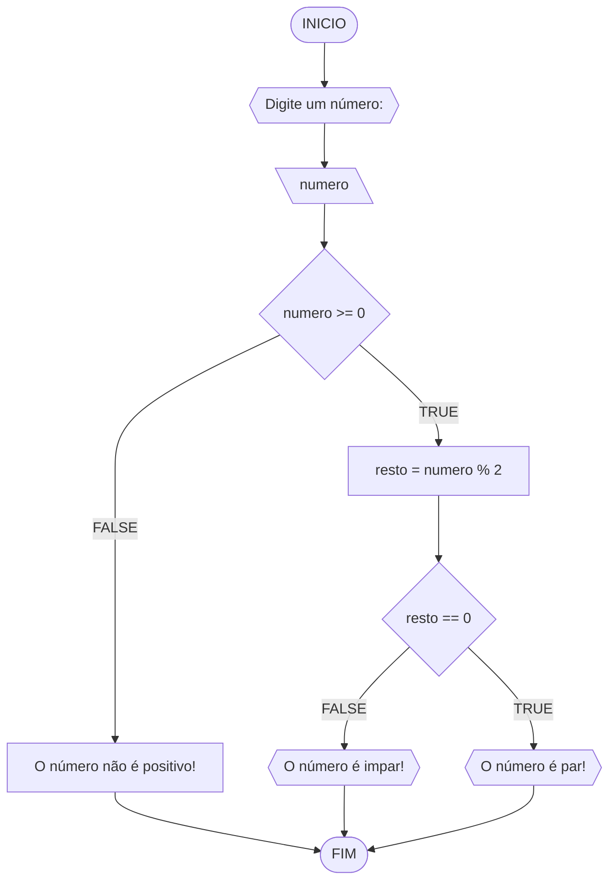
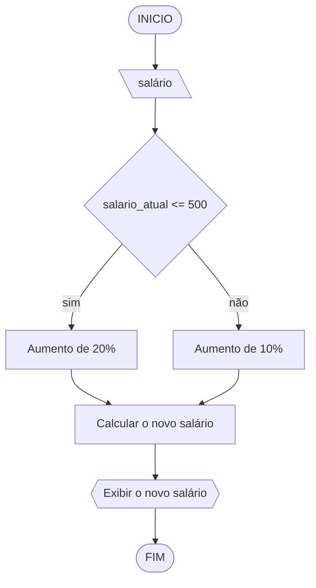
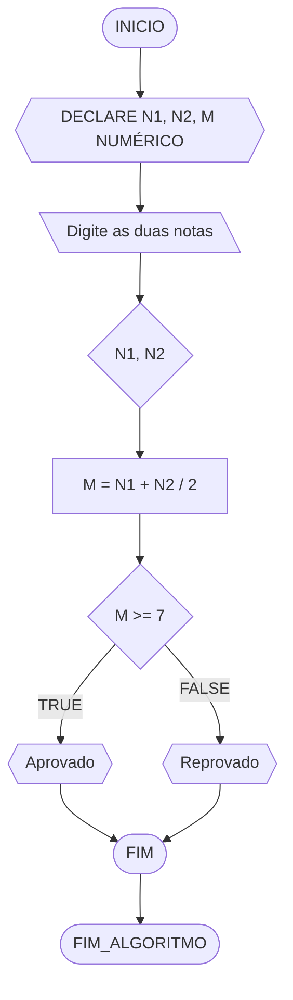
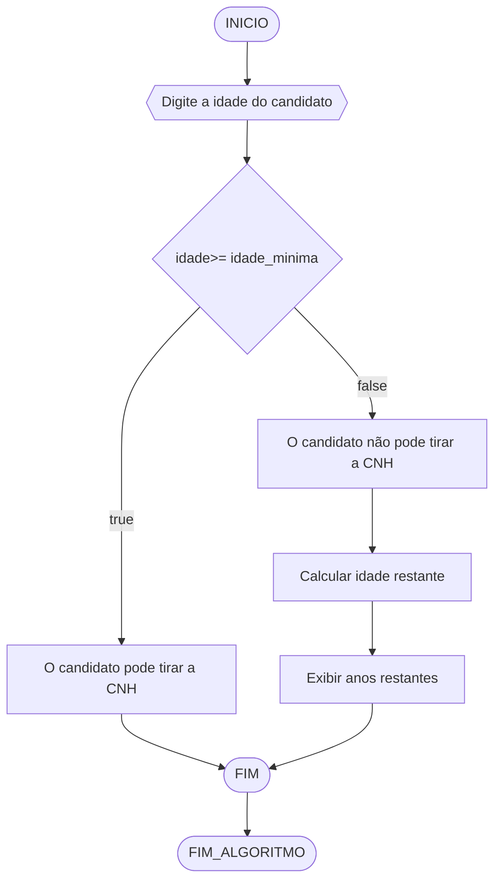

# UNIFOR
**Nome**: Allan Justo de Freitas
**Professor**: Carubbi
**Disciplina**: Raciocínio lógico algorítmico

## Lista de exercícios 01

### Exercício 01 
Represente, em fluxograma e pseudocódigo, um algoritmo para determinar se um número inteiro e positivo é par ou impar.

#### Fluxograma 



#### Pseudocódigo 
```
1  ALGORTIMO verifica_par_impar
2  DECLARE numero, resto: INTEIRO
3  ESCREVA "Digite um número: "
4  INICIO
4  LEIA numero
5  SE numero >= 0 ENTAO                  // verifica se o inteiro é positivo
6    resto = numero % 2                 // calcula o resto da divisão por 2
7    SE resto == 0 ENTAO                // verifica se o resto é igual a zero
8      ESCREVA "O número é par!"
9    SENAO
10     ESCREVA "O número é impar!"
11   FIM_SE
11  SENAO                                // caso inteiro for negativo (condição linha 5)
12    ESCREVA "O número deve ser postivo!"
13  FIM_SE
13 FIM
```

#### Teste de mesa 
| numero | numero >= 0 | resto | resto == 0 | Saída |
| -- | -- | -- | -- | -- | 
| -1 | F |   |   | "O número deve ser postivo!" |
| 0  | V | 0 | V | "O número é par!" |
| 13 | V | 1 | F | "O número é impar!" |
| 30 | V | 0 | V | "O número é par!" |

## Exercício 02 
Represente, em fluxograma e pseudocódigo, um algoritmo para calcular o novo salário de um funcionário. 
Sabe-se que os funcionários que recebem atualmente salário de até R$ 500 terão aumento de 20%; os demais terão aumento de 10%.

#### Fluxograma


#### Pseudocódigo 

```
 ALGORITMO NOVO SALÁRIO 
    DECLARE salario, salario_novo 
    ESCREVA "Digite seu salário:"
    LEIA salario
    SE salario > 500
    ENTÃO
        salario_novo = salario * 1.10
        ESCREVA "Novo salário:", salario_novo
    SENÃO
        salario_novo = salario * 1.20
        ESCREVA "Novo salário:", salario_novo
    FIM ALGORITMO
```
```
#### Teste de mesa 
| salário atual | | salário <=500 | novo salário | saída | 
|     450       |      não     |      450* 1,2    |     540   | 
|     800       |      sim     |      800* 1,6    |     880   |
|     600       |      sim     |      600*1,6     |     660   |
```

## Exercício 03 
Represente, em fluxograma e pseudocódigo, um algoritmo para calcular a média aritmética entre duas notas de um aluno e mostrar sua situação, que pode ser aprovado ou reprovado.

#### Fluxograma 



#### Pseudocódigo 

```
ALGORITMO MÉDIA 
DECLARE N1, N2, M NUMÉRICO
ESCREVA "Digite as duas notas"
LEIA N1, N2
M= (N1+N2)/2
SE M >- 7
ENTÃO ESCREVA "Aprovado"
SENÃO
ESCREVA "Reprovado""
FIM_ALGORITMO.
```

#### Teste de mesa 

| nota N1| nota N2 | calcular média | M> 7 | resultando | 
|     --  |    --   |      --      |  --   |      --      | 
|    7    |    4    | M= (N1+N2)/2 |  5.5  |  reprovado   |
|    --   |   --    |     --       |   --  |      --      |

# Exercício 04 
Represente, em fluxograma e pseudocódigo, um algoritmo que, a partir da idade do candidato(a), determinar se pode ou não tirar a CNH. 
Caso não atender a restrição de idade, calcular quantos anos faltam para o candidato estar apto.

#### Fluxograma 


#### Pseudocódigo 

ALGORITMO Verificar_CNH
DECLARE idade, idade_minima, idade_restante NUMÉRICO

ESCREVA "Digite a idade do candidato(a):"
LEIA idade

idade_minima = 18  // Idade mínima para tirar CNH no Brasil

SE idade >= idade_minima

ENTÃO
   
  ESCREVA "O candidato pode tirar a CNH."
SENÃO
    ESCREVA "O candidato não pode tirar a CNH."
      
    
idade_restante = idade_minima - idade

 ESCREVA "Faltam", idade_restante, "anos para o candidato estar apto."

FIM_ALGORITMO
```

```
#### Teste de mesa (1.0 ponto)

| idade do candidato | idade>= 18 | anos para apto| 
|      --            |      --    |      --      |   
|      16            |     não    |       2      |  
|      24            |     sim    |       0      |


