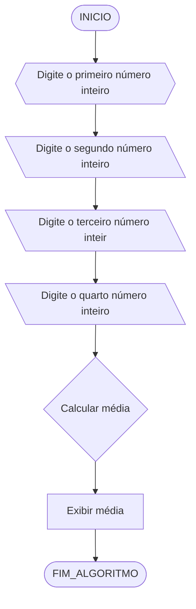
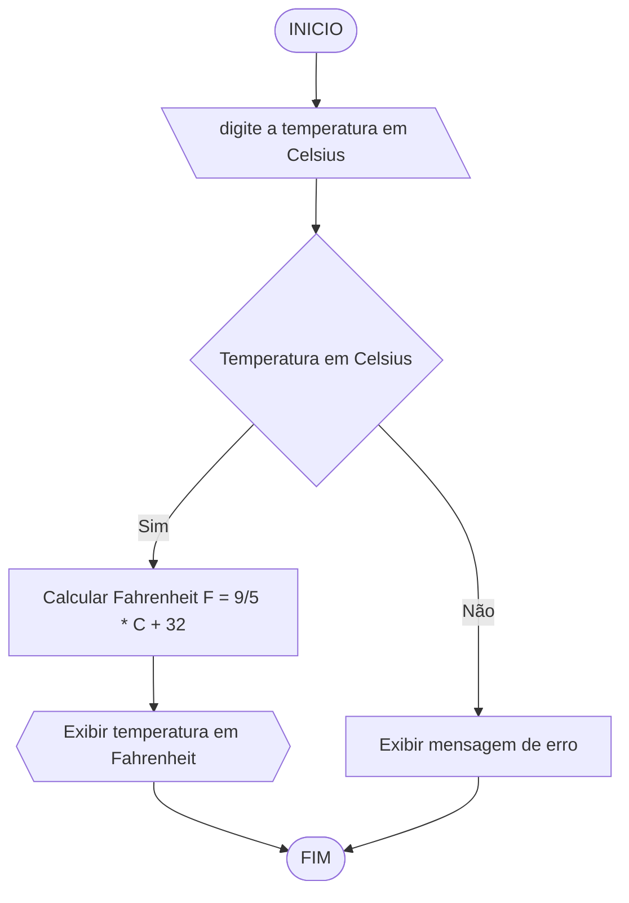
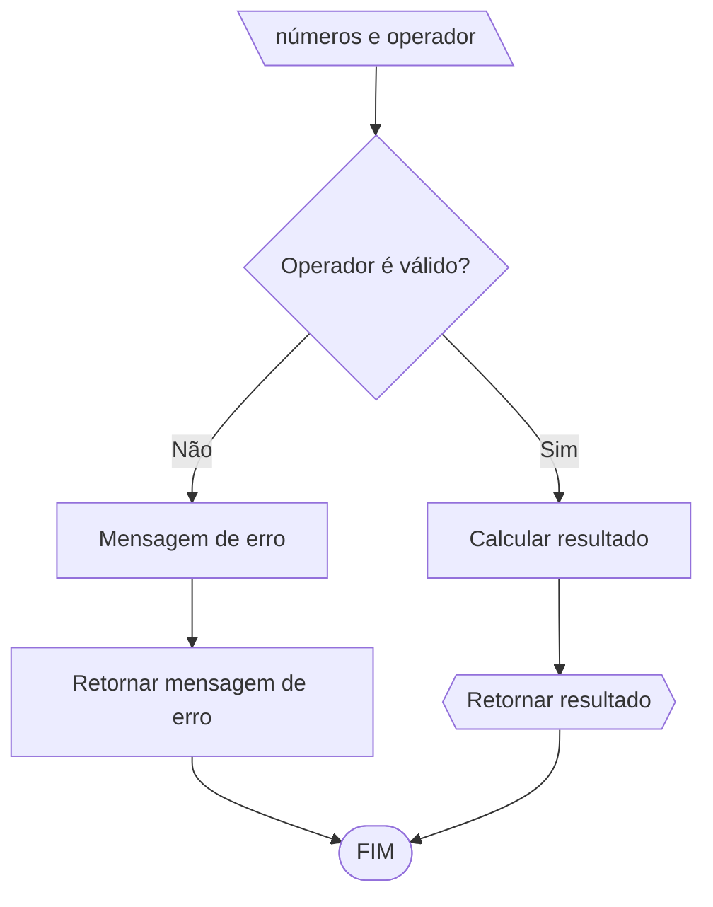

# UNIFOR
**Nome**: Allan Justo de Freitas 

**professor**: Carubbi

**Disciplina**: Raciocínio lógico algorítm

## Lista de exercícios 02

### Exercício 01 
Calcule a média de quatro números inteiros dados.

#### Fluxograma 


#### Pseudocódigo
```
ALGORITMO Calcular_Media
DECLARE num1, num2, num3, num4, media NUMÉRICO

ESCREVA "Digite o primeiro número inteiro:"
LEIA num1

ESCREVA "Digite o segundo número inteiro:"
LEIA num2

ESCREVA "Digite o terceiro número inteiro:"
LEIA num3

ESCREVA "Digite o quarto número inteiro:"
LEIA num4

media = (num1 + num2 + num3 + num4) / 4

ESCREVA "A média dos quatro números é:", media
FIM_ALGORITMO
```
```
#### Teste de mesa

| primeiro número | segundo número | terceiro número | quarto numero  |     Média |    | Média final |
|       --        |       --       |        --       |      --        |      --        |             |
|       50        |       35       |        10       |      8         | (50+35+10+8/4) |     25,7    |
|       --        |       --       |         --      |      --        |      --        |             |

### Exercício 02 
Leia uma temperatura dada em Celsius (C) e imprima o equivalente em Fahrenheit (F). (Fórmula de conversão: F = (9/5) * C + 32)
```
#### Fluxograma


#### Pseudocódigo 
ALGORITMO CONVERTER_CElCIUS_FARENHEIT:
DECLARE Celsius, Fahrenheit NUMÉRICO


ESCREVA "Insira a temperatura em graus Celsius:"
Leia em Celsius

Fahrenheit = (9/5) * Celsius + 32

Escreva "A temperatura Fahrenheit (F) é" em graus Fahrenheit.

FIM_ALGORITMO
```
#### Teste de mesa 

| temp (C) |            cacular p/ (F)            | Temp (F) |
|    --    | (9/5) * Celsius + 32                 |    --    |   
|    20°C  | F = (9/5) * 20 + 32 = 36 + 32 = 68°F |    68°F  |
|    38°C  | F = (9/5) * 38 + 32 = 36 + 32 = 100°F|   100°F  |

```
### Exercício 03 
Receba dois números reais e um operador e efetue a operação correspondente com os valores recebidos (operandos). 
O algoritmo deve retornar o resultado da operação selecionada simulando todas as operações de uma calculadora simples.
```
#### Fluxograma


#### Pseudocódigo 
```
ALGORITIMO_CALCULADORA
Cálculo de função (operador, num1, num2)
    se operador == '+'
       
        retorna num1 + num2
    senão se operador == '-'
        retorna num1 - num2
    senão se operador == '*'
        retorna num1 * num2
    senão se operador == '/'
       
        Se num2 == 0
            Retorna "Erro: Divisão por zero".
        Se não
            Retorna número 1/número 2
    Se não
        retorna "operador inválido"

Função principal

    //Recebe o número e operadora enviado pelo usuário
    Escreva "Por favor, insira o primeiro número:".
    Leia o número 1
    Escreva "Por favor, insira o segundo número:".
    por favor leia o número 2
    Escreva "operadores de entrada (+, -, , /):".
    operador de leitura
    
    //Resultado do cálculo
    resultado = cálculo(operador, num1, num2)
    
    //mostra o resultado
    "Resultado da operação:", descreva o resultado
FIM_ALGORITIMO
```
```
#### Teste de mesa 
| Números | operação | operador válido | Resultado |  
|   --    |     --   |      --         |    --     |   
|   5     | adição   |      sim        |    15     |
|   10    | adição   |      sim        |    --     |

### Exercício 04 
Elaborar um algoritmo que, dada a idade, classifique nas categorias: infantil A (5 - 7 anos), infantil B (8 -10 anos), juvenil A (11 - 13 anos), juvenil B (14 -17 anos) e adulto (maiores que 18 anos).
```
#### Fluxograma 
mermaid
flowchart TD
A([inicio])--> B[\ idade do usuário \]
 B-->Idade --> VerificarIdade{Verificar idade}
    VerificarIdade -->|Idade >= 5 e idade <= 7| 
    CategoriaInfantilA[Infantil A]
    VerificarIdade -->|Idade >= 8 e idade <= 10| 
    CategoriaInfantilB[Infantil B]
    VerificarIdade -->|Idade >= 11 e idade <= 13| 
    CategoriaJuvenilA[Juvenil A]
    VerificarIdade -->|Idade >= 14 e idade <= 17| 
    CategoriaJuvenilB[Juvenil B]
    VerificarIdade -->|Idade > 18| 
    CategoriaAdulto[Adulto]
    VerificarIdade -->|Idade inválida| IdadeInvalida[Idade inválida]


#### Pseudocódigo 
```
ALGORITIMO VERIFICAR_IDADE
Início
    // Solicitar a idade do usuário
    Ler idade
    
    // Verificar em qual categoria a idade se encaixa
    Se idade >= 5 e idade <= 7 então
        Escrever "Categoria: Infantil A"
    Senão Se idade >= 8 e idade <= 10 então
        Escrever "Categoria: Infantil B"
    Senão Se idade >= 11 e idade <= 13 então
        Escrever "Categoria: Juvenil A"
    Senão Se idade >= 14 e idade <= 17 então
        Escrever "Categoria: Juvenil B"
    Senão Se idade > 18 então
        Escrever "Categoria: Adulto"
    Senão
        Escrever "Idade inválida"
FIM_ALGORITIMO
```
```
#### Teste de mesa

| Idade |     verificar idade     | Infantil A   | Infantil B | Juvenil A | Juvenil B | Adulto  |
|   21  |Idade >= 5 e idade <= 7  |    não       |     não    |     não   |     não   |   sim   |
|   9   |Idade >= 8 e idade <= 10 |    não       |     sim    |     não   |     não   |   não   |
|   14  |Idade >= 14 e idade <= 17|    não       |     não    |     não   |     sim   |   não   |
|   --  |      Idade > 18         |    não       |     não    |     não   |     não   |   não   |
```
