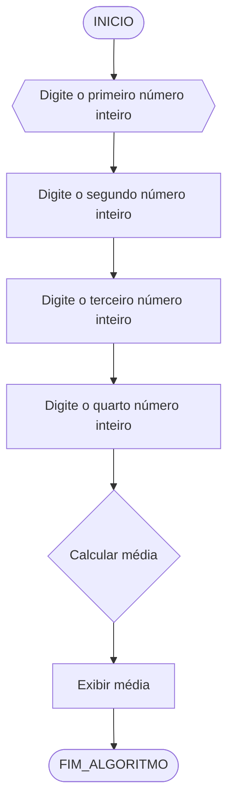
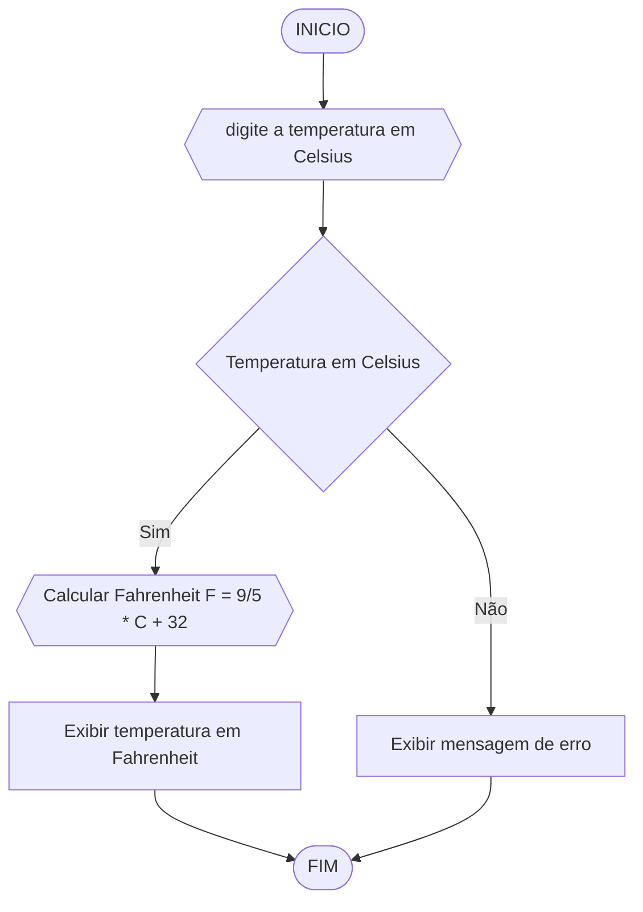
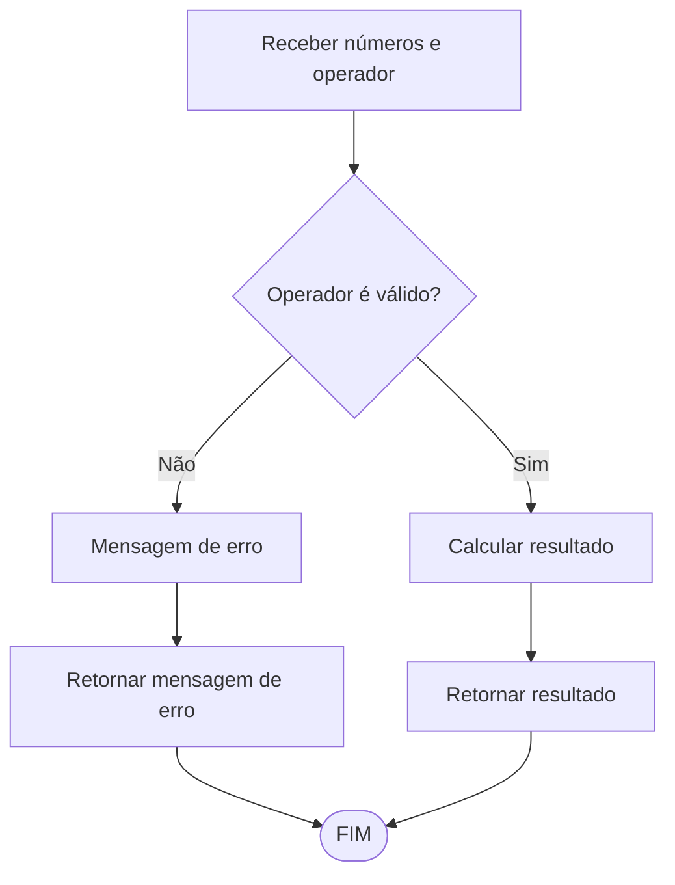

# UNIFOR
**Nome**: Allan Justo de Freitas 

**professor**: Carubbi

**Disciplina**: Raciocínio lógico algorítm

## Lista de exercícios 01

### Exercício 01 
Calcule a média de quatro números inteiros dados.

#### Fluxograma 


#### Pseudocódigo
```
ALGORITMO Calcular_Media
DECLARE num1, num2, num3, num4, media NUMÉRICO

ESCREVA "Digite o primeiro número inteiro:"
LEIA num1

ESCREVA "Digite o segundo número inteiro:"
LEIA num2

ESCREVA "Digite o terceiro número inteiro:"
LEIA num3

ESCREVA "Digite o quarto número inteiro:"
LEIA num4

media = (num1 + num2 + num3 + num4) / 4

ESCREVA "A média dos quatro números é:", media
FIM_ALGORITMO
```

#### Teste de mesa

| nome_coluna1 | nome_coluna2 | nome_coluna3 | nome_coluna4 | nome_coluna5 | 
|      --      |      --      |      --      |      --      |      --      | 
| Adicione     | espaço       | se quiser    |  alinhar     | as barras    |
| verticais,   | mas          | não é        | obrigatório. | Entendido ?  |

### Exercício 02 
Leia uma temperatura dada em Celsius (C) e imprima o equivalente em Fahrenheit (F). (Fórmula de conversão: F = (9/5) * C + 32)

#### Fluxograma


#### Pseudocódigo 
ALGORITMO_Celsius_Fahrenheit 
DECLARE Celsius, Fahrenheit NUMÉRICO


ESCREVA "Insira a temperatura em graus Celsius:"
Leia em Celsius

Fahrenheit = (9/5) * Celsius + 32

Escreva "A temperatura Fahrenheit (F) é" em graus Fahrenheit.
FIM_ALGORITMO
```
Algoritmo ConverteCelsiusFarenheit:
```
#### Teste de mesa 

| nome_coluna1 | nome_coluna2 | nome_coluna3 | nome_coluna4 | nome_coluna5 | 
|      --      |      --      |      --      |      --      |      --      | 
| Adicione     | espaço       | se quiser    |  alinhar     | as barras    |
| verticais,   | mas          | não é        | obrigatório. | Entendido ?  |

### Exercício 03 
Receba dois números reais e um operador e efetue a operação correspondente com os valores recebidos (operandos). 
O algoritmo deve retornar o resultado da operação selecionada simulando todas as operações de uma calculadora simples.

#### Fluxograma



#### Pseudocódigo 
```
ALGORITIMO_CALCULADORA
Cálculo de função (operador, num1, num2)
    se operador == '+'
       
        retorna num1 + num2
    senão se operador == '-'
        retorna num1 - num2
    senão se operador == '*'
        retorna num1 * num2
    senão se operador == '/'
       
        Se num2 == 0
            Retorna "Erro: Divisão por zero".
        Se não
            Retorna número 1/número 2
    Se não
        retorna "operador inválido"

Função principal

    //Recebe o número e operadora enviado pelo usuário
    Escreva "Por favor, insira o primeiro número:".
    Leia o número 1
    Escreva "Por favor, insira o segundo número:".
    por favor leia o número 2
    Escreva "operadores de entrada (+, -, , /):".
    operador de leitura
    
    //Resultado do cálculo
    resultado = cálculo(operador, num1, num2)
    
    //mostra o resultado
    "Resultado da operação:", descreva o resultado
FIM
```

#### Teste de mesa 
| nome_coluna1 | nome_coluna2 | nome_coluna3 | nome_coluna4 | nome_coluna5 | 
|      --      |      --      |      --      |      --      |      --      | 
| Adicione     | espaço       | se quiser    |  alinhar     | as barras    |
| verticais,   | mas          | não é        | obrigatório. | Entendido ?  |

### Exercício 04 
Elaborar um algoritmo que, dada a idade, classifique nas categorias: infantil A (5 - 7 anos), infantil B (8 -10 anos), juvenil A (11 - 13 anos), juvenil B (14 -17 anos) e adulto (maiores que 18 anos).

#### Fluxograma 


