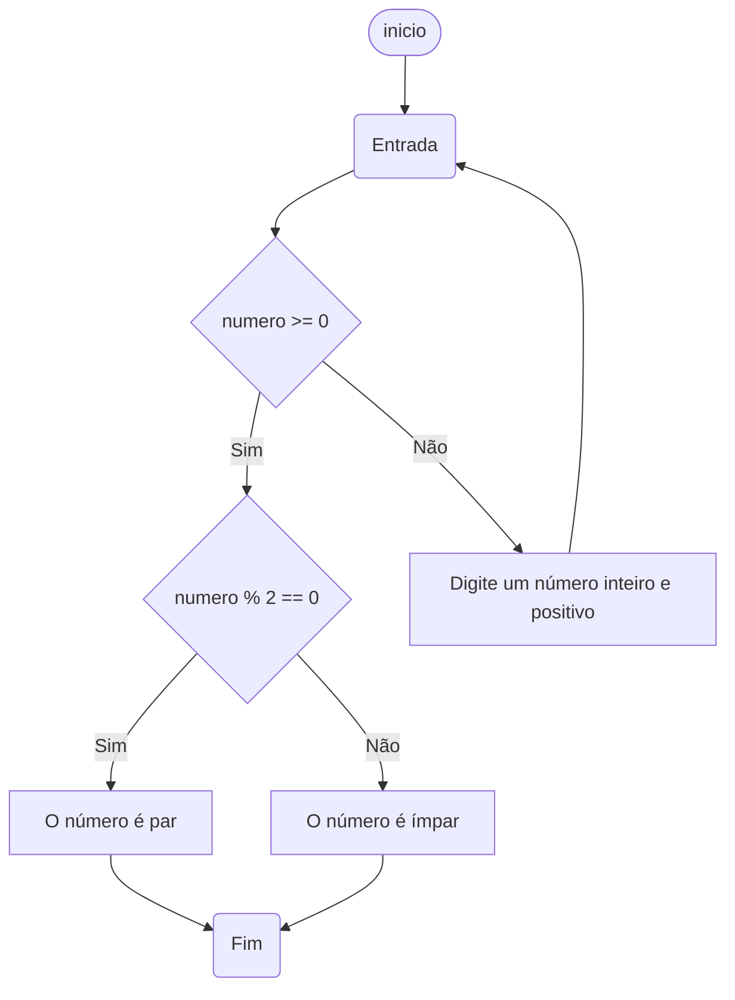

# UNIFOR
**Nome**: Alla Justo

**professor**: Carubbi

**Disciplina**: Raciocínio lógico algorítmico
### Exercício 01 
Atualize o algoritmo para determinar se um número inteiro e positivo é par ou ímpar, usando uma laço condicional para aceitar apenas números maiores ou iguais a zero. 

#### Fluxograma


#### Pseudocódigo 
```
ALGORITMO CLASSIFICAR_CATEGORIA
Algoritmo Verifica_Par_Impar
    // Variáveis
    inteiro numero
    
    // Entrada
    Escreva("Digite um número inteiro e positivo: ")
    Leia(numero)
    
    // Verificação de número positivo
    Enquanto numero < 0
        Escreva("O número digitado não é positivo. Digite um número inteiro e positivo: ")
        Leia(numero)
    
    // Verificação de par ou ímpar
    Se numero % 2 = 0 Então
        Escreva("O número ", numero, " é par.")
    Senão
        Escreva("O número ", numero, " é ímpar.")
    FIM_ALGORITIMO

   
