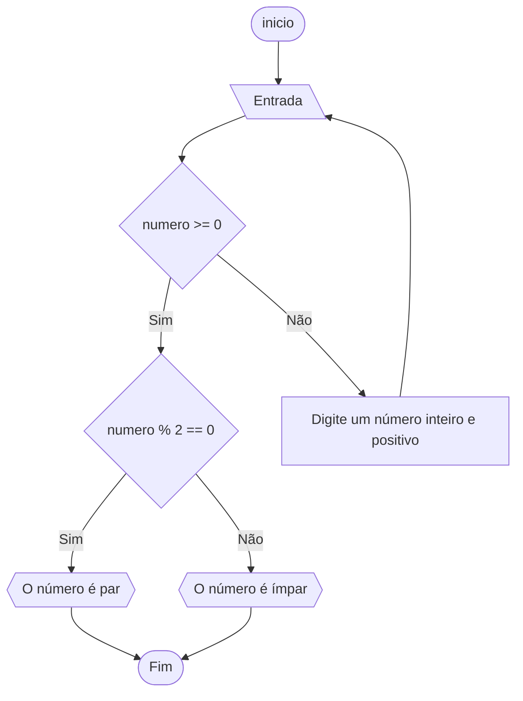
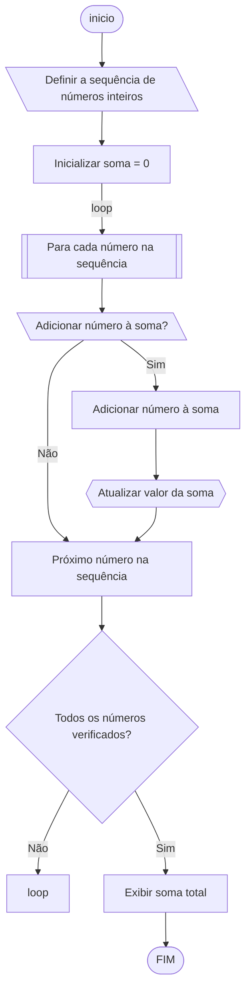
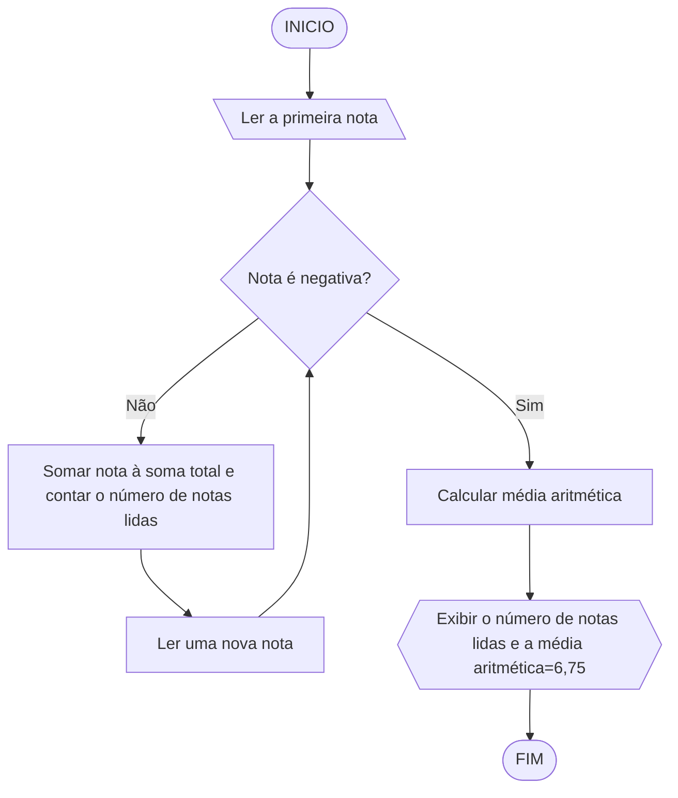

# UNIFOR
**Nome**: Allan Justo

**professor**: Carubbi

**Disciplina**: Raciocínio lógico algorítmico
### Exercício 01 
Atualize o algoritmo para determinar se um número inteiro e positivo é par ou ímpar, usando uma laço condicional para aceitar apenas números maiores ou iguais a zero. 

#### Fluxograma


#### Pseudocódigo 
```
ALGORITMO CLASSIFICAR_CATEGORIA
Algoritmo Verifica_Par_Impar
    // Variáveis
    inteiro numero
    
    // Entrada
    Escreva("Digite um número inteiro e positivo: ")
    Leia(numero)
    
    // Verificação de número positivo
    Enquanto numero < 0
        Escreva("O número digitado não é positivo. Digite um número inteiro e positivo: ")
        Leia(numero)
    
    // Verificação de par ou ímpar
    Se numero % 2 = 0 Então
        Escreva("O número ", numero, " é par.")
    Senão
        Escreva("O número ", numero, " é ímpar.")
    FIM_ALGORITIMO

#### Teste de mesa
|Entrada| positivo| nova entrada |positivo |	verificar impar/par | 
|  -3	  |   não   |	    8       |  sim    |   par               |
|   9   |	sim	|      --      |	sim    |   impar             |
```

### Exercício 02
### Faça um algoritmo que exiba na tela uma contagem de 0 até 30, exibindo apenas os múltiplos de 3.

#### Fluxograma


#### Pseudocódigo

```
ALGORITIMO_MULTIPLOS_DE_3
contador = 0  // Inicialize o contador

ENQUANTO contador <= 30 FAÇA
    SE contador % 3 == 0 ENTÃO
        EXIBIR contador  // Exibir apenas os múltiplos de 3
    FIM SE
    contador = contador + 1  // Incrementar o contador
FIM ENQUANTO
FIM_ALGORITIMO

```
#### Teste de mesa

```
 
| nome_coluna1 | nome_coluna2 | nome_coluna3 | nome_coluna4 | nome_coluna5 | 
|      --      |      --      |      --      |      --      |      --      | 
| Adicione     | espaço       | se quiser    |  alinhar     | as barras    |
| verticais,   | mas          | não é        | obrigatório. | Entendido ?  |
```

### Exercício 03 
Dada uma sequência de números inteiros, calcular a sua soma. 
Por exemplo, para a sequência {12, 17, 4, -6, 8, 0}, o seu programa deve escrever o número 35.


#### Fluxograma

#### Pseudocódigo 
```
AlGORITIMO_SOMA_NÚMEROS_INTEIROS
// Definir a sequência de números inteiros
sequencia = {12, 17, 4, -6, 8, 0}
// Inicializar a variável para armazenar a soma
soma = 0
// Iterar sobre cada elemento da sequência
PARA cada número NA sequencia FAÇA
    // Adicionar o número à soma
    soma = soma + número
FIM PARA

// Exibir a soma total
EXIBIR soma
FIM_ALGORITMO
```
#### Teste de mesa
```
| número | número II | número III | número IV | número V |  soma total |
|0 + (12)|  12+ (17) |  29+(4)    |  29-(6)   | 27+(8)   |   35        |
| --     | --        | --         |  --       |  --      |
| --     | --        | --         | --        | --       |        
```

### Exercício 04
Escreva um programa que leia a nota de diversos alunos, até que seja digitada uma nota negativa. 
Nesse momento, ele mostra a média aritmética de todas as notas lidas e quantas notas foram lidas. 
Ex. Foram lidas 14 notas. A média aritmética é 6.75!

#### Fluxograma

#### pseudocódigo
```
ALGORITIMO_VARIÁVEIS 
// Inicializar variáveis
soma_notas = 0
numero_notas = 0
// Ler a primeira nota
LER nota
ENQUANTO nota >= 0 FAÇA
    // Somar a nota à soma total
    soma_notas = soma_notas + nota
    // Contar o número de notas lidas
    numero_notas = numero_notas + 1
    // Ler a próxima nota
    LER nota
FIM ENQUANTO
// Calcular a média aritmética
SE numero_notas > 0 ENTAO
    media = soma_notas / numero_notas
    // Exibir o número de notas lidas e a média aritmética
    EXIBIR "Foram lidas ", numero_notas, " notas. A média aritmética é ", media, "!"
SENÃO
    // Se nenhum nota foi lida, exibir mensagem
    EXIBIR "Nenhuma nota foi lida!"
FIM_ENQUANTO
FIM
```

#### Teste de mesa 
| n1  | nota negativa | n lidas | n2  | nota negativa   | n2 lidas  | n3 | nota negativa| n3 lidas| Média |
|  8  |   não         |      1  |   7  |      não      |   2        | 6  |     -1       | 3       | 8+7+6= 21|
                                                                                                  |21/3= 7|

